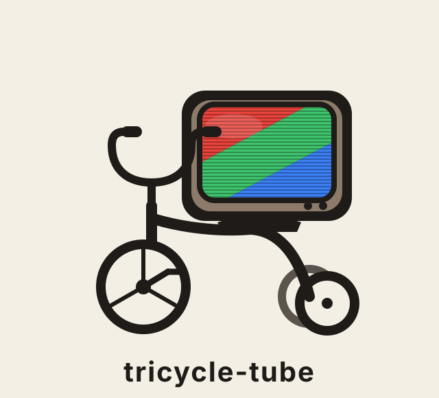
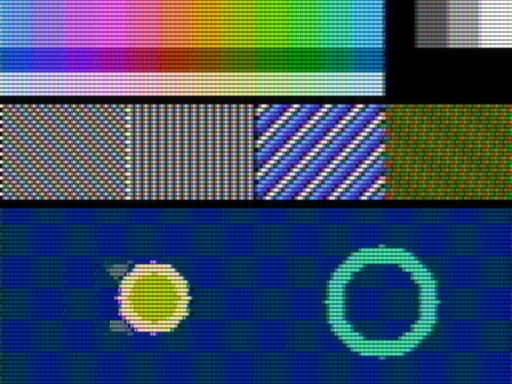

<p align="center"></p>

# tricycle-tube

A display specification that reproduces how a Famicom / NES picture looked on a CRT — the composite-signal colour bleed, the rotating false colours, the scanlines and the phosphor afterglow — written so that **an AI agent (or you) can rebuild it from the spec alone**, in a new emulator, in a modified one, or as a shader.

**tricycle-tube** is the name given to this combination of techniques. *tri* + *cycle*: the colour phase cycles through three states; *tube*: the cathode-ray tube it imitates. Hence the logo — a tricycle carrying a picture tube.

- **[spec/SPEC.md](spec/SPEC.md)** — the specification (English, normative). [日本語版](spec/SPEC.ja.md)
- **[conformance/vectors.json](conformance/vectors.json)** — expected outputs with tolerances, generated by the reference implementation
- **[reference/crt_reference.py](reference/crt_reference.py)** — pure-Python reference implementation, no dependencies
- **[prompts/REPRODUCE.md](prompts/REPRODUCE.md)** — the prompt to hand to an agent together with the spec and the vectors

Two blind reproduction tests have passed: an agent that had never seen the prototype implemented every stage from the spec and matched all 38 conformance items on its first run. A separate GPU (WGSL) implementation written from the spec matched the vectors within tolerance.

## What it does

```
palette indices (256×240) + frame phase
  → signal stage   : 12-phase composite encode → notch luma, band-limited chroma, YIQ→RGB   (2048×240)
  → CRT stage      : ×12 vertical, beam spot, Gaussian scanlines, phosphor stripes, bloom   (2048×2880)
  → afterglow      : blend the last 3 frames (6:3:1); static pixels only, judged against the same-phase frame
  → downscale      : area average to the window
```

The look is deliberate rather than strictly faithful: the subcarrier phase is advanced 120° every frame (a 3-frame cycle), so the false colours keep rotating and fine patterns crawl, while the afterglow keeps static areas calm. Real hardware normally runs a 2-frame cycle; the spec defines both and a hardware-faithful mode.

## Samples

Rendered from the reference implementation at 60 fps (APNG; your browser plays it). All sample art is original — no game graphics are used.

<p align="center"></p>

`samples/` also has the 2-frame (hardware-faithful) cycle for comparison. Note that an animated GIF at 30 fps would show every other frame and stretch the flicker interval to twice its real length.

## Reproduce it with an agent

Give the agent [spec/SPEC.md](spec/SPEC.md), [conformance/vectors.json](conformance/vectors.json) and the prompt in [prompts/REPRODUCE.md](prompts/REPRODUCE.md). The vectors tell it when it is done. Run `python3 conformance/gen_vectors.py out.json` to regenerate the vectors from the reference.

## What is new here, and what is not

Every individual technique is published prior art: composite encode/decode of the NES's 12-phase colour (blargg's nes_ntsc, Bisqwit's articles, the NESdev Wiki, several RetroArch shaders), scanline/mask/bloom CRT shaders, phosphor-persistence shaders, and motion-adaptive temporal processing (the idea behind 3D comb filters). What this project adds is modest: the afterglow is gated by a same-phase comparison tuned to the NES phase cycle; the look was tuned against photographs of real CRTs; and, above all, the whole thing is written as a specification with conformance vectors that another implementation can be checked against.

## Licence

- Specification and documentation (`spec/`, `prompts/`, this README): [CC BY 4.0](LICENSE-SPEC.md)
- Code (`reference/`, `conformance/`, `samples/*.py`): [MIT](LICENSE)
- Logo: CC BY 4.0. The wordmark is set in Inter (SIL Open Font License 1.1), converted to outlines; no font files are distributed.

Sources are listed in the spec (§11). Signal levels come from measurements published on the NESdev Wiki. No code from nes_ntsc, GTU-famicom, patchy-ntsc, fami-rf or other projects is used.
